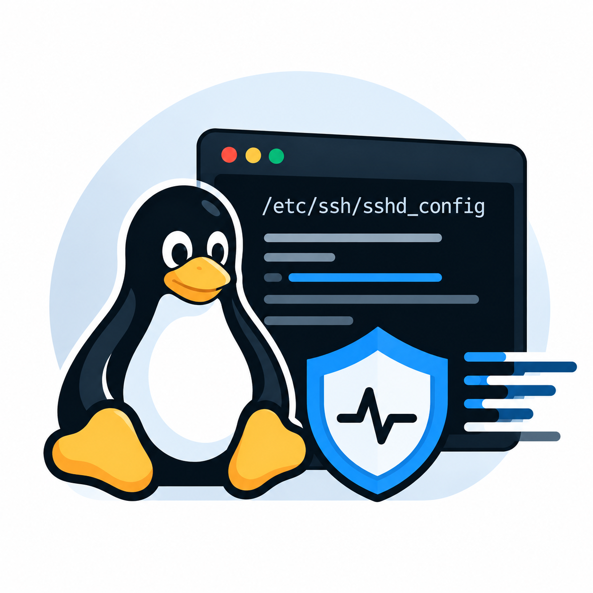
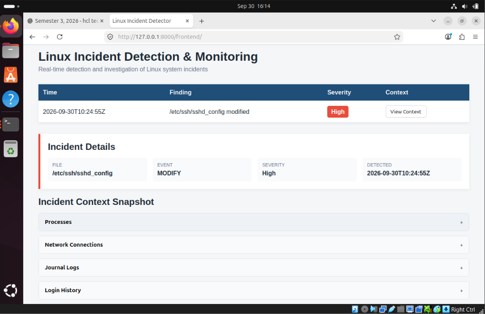
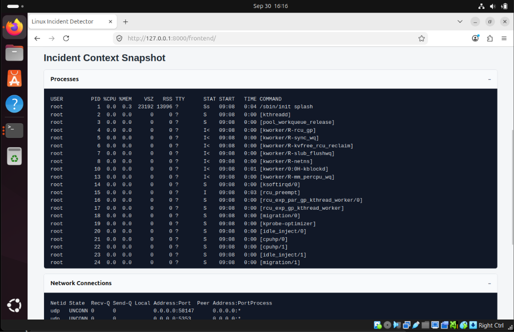
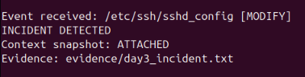
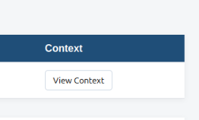

<center>


<h1>Linux Incident Detection & Monitoring</h1>

A lightweight Linux server monitoring system that detects suspicious system changes and captures the surrounding system state as an **Incident Context Snapshot** for investigation.

> **P_206: Incident Detection on Linux Server**

</center>
---

## Problem Statement

> Incident detection on a Linux server involves monitoring system activities and identifying unusual patterns or behaviors related to potential security threats such as unauthorized access, malware, or configuration changes.

This project focuses on detecting **unauthorized or unexpected modification of a critical Linux configuration file** and automatically collecting relevant system information when the incident occurs.

---

## What We Built

The system continuously monitors:

```text
/etc/ssh/sshd_config
```

When the file is modified:

1. The Go agent detects the filesystem event.
2. The event is passed to the Python detection engine.
3. The rule engine validates whether the event matches a detection rule.
4. An incident is created.
5. A **Context Snapshot** is captured.
6. The finding is written to `findings.json`.
7. The static dashboard displays the incident.
8. The investigator can inspect the captured context.

---

## Key Feature — Incident Context Snapshot

Instead of recording only:

```text
/etc/ssh/sshd_config modified
```

the system captures the surrounding Linux state at the time of detection.

The snapshot currently contains:

| Section                 | Information                           |
| ----------------------- | ------------------------------------- |
| **Processes**           | Running processes using `ps`          |
| **Network Connections** | Listening/active sockets using `ss`   |
| **Journal Logs**        | Recent system logs using `journalctl` |
| **Login History**       | Recent login activity using `last`    |

The dashboard presents these sections as **collapsible panels** so an investigator can inspect only the information they need.

### Why this matters

If a configuration file is unexpectedly modified, the important question is not only:

> "What file changed?"

but also:

> "What was happening on the server when it changed?"

The context snapshot provides that information immediately instead of requiring the administrator to reconstruct the state manually afterward.

---

## Architecture

```text
                    Linux Server / VM
                           │
                           ▼
                  ┌─────────────────┐
                  │    Go Agent     │
                  │    fsnotify     │
                  └────────┬────────┘
                           │
                      JSON event
                           │
                           ▼
                  ┌─────────────────┐
                  │ Python Rule     │
                  │ Engine          │
                  └────────┬────────┘
                           │
                     Rule matched
                           │
                           ▼
                  ┌─────────────────┐
                  │    Incident     │
                  └────────┬────────┘
                           │
                           ▼
              ┌────────────────────────┐
              │  Context Snapshot      │
              │                        │
              │  • ps                  │
              │  • ss                  │
              │  • journalctl          │
              │  • last                │
              └───────────┬────────────┘
                          │
                          ▼
                 runtime/findings.json
                          │
                          ▼
              ┌────────────────────────┐
              │ Static Web Dashboard   │
              └────────────────────────┘
```

---

## Components

### 1. Go Monitoring Agent

The Go agent uses [`fsnotify`](https://github.com/fsnotify/fsnotify) to monitor the target configuration file.

```text
/etc/ssh/sshd_config
```

When a modification occurs, it produces a structured JSON event:

```json
{
  "event": "MODIFY",
  "path": "/etc/ssh/sshd_config",
  "timestamp": "2026-09-30T10:17:32Z"
}
```

---

### 2. Python Detection Engine

The Python rule engine receives events from the Go agent and evaluates them against the configured detection rule.

Current rule:

```text
IF
    path == /etc/ssh/sshd_config
AND
    event == MODIFY

THEN
    create incident
    capture context snapshot
    save finding
```

---

### 3. Context Snapshot

When an incident is detected, the engine collects:

```bash
ps aux
ss -tulpn
journalctl --no-pager -n 50
last -n 10
```

The collected information is attached to the incident.

---

### 4. Findings Storage

Current findings are stored as:

```text
runtime/findings.json
```

Example structure:

```json
{
  "time": "2026-09-30T10:17:32Z",
  "summary": "/etc/ssh/sshd_config modified",
  "severity": "High",
  "file": "/etc/ssh/sshd_config",
  "event": "MODIFY",
  "snapshot": "..."
}
```

`runtime/` contains generated runtime data and is not committed to Git.

---

### 5. Dashboard

The project includes a lightweight static HTML/CSS/JavaScript dashboard.

It provides:

* Live incident list
* Severity indicators
* Automatic refresh
* Incident details
* Context Snapshot
* Collapsible process information
* Collapsible network information
* Collapsible journal logs
* Collapsible login history

---

## Dashboard

### Live Incident Dashboard



---

### Incident Context View

The context view allows the investigator to inspect the system state captured when the incident occurred.



---

## Project Structure

```text
linux-incident-detector/
│
├── agent/
│   ├── main.go
│   ├── go.mod
│   └── go.sum
│
├── backend/
│   └── rule_engine.py
│
├── frontend/
│   └── index.html
│
├── docs/
│   ├── 1-attack.md
│   ├── architecture.md
│   └── evidence/
│       ├── day2/
│       └── day3/
│
├── evidence/
│
├── runtime/
│   └── findings.json
│
├── .gitignore
└── README.md
```

`runtime/` is generated during execution and is ignored by `git`.

---

# Running the Project

## Requirements

* Ubuntu/Linux system
* Go 1.22+
* Python 3
* `fsnotify`
* `ps`
* `ss`
* `journalctl`
* `last`

The project is currently tested on **Ubuntu 24.04 running inside VirtualBox**.

---

## 1. Clone the Repository

```bash
git clone https://github.com/ayushHardeniya/linux-incident-detector.git
cd linux-incident-detector
```

---

## 2. Build the Go Agent

```bash
cd agent
go build -o incident-agent .
cd ..
```

---

## 3. Start the Detection Pipeline

From the repository root:

```bash
./agent/incident-agent | python3 backend/rule_engine.py
```

The Go agent watches:

```text
/etc/ssh/sshd_config
```

The Python engine waits for events from the agent.

---

# Testing an Incident

In another terminal, modify the monitored configuration file:

```bash
echo "# demo-incident" | sudo tee -a /etc/ssh/sshd_config
```

The detector should report:



A finding will then be created in:

```text
runtime/findings.json
```

---

# Viewing the Dashboard

From the repository root, start the static web server:

```bash
python3 -m http.server 8000
```

Open:

```text
http://localhost:8000/frontend
```

The dashboard automatically refreshes every few seconds.



Select **View Context** on an incident to inspect its Context Snapshot.

---

# Negative Control

The system should not report unrelated file changes.

For example:

```bash
echo "normal activity" >> ~/notes.txt
```

This file is not monitored by the current rule.

Therefore:

```text
No incident should be generated.
```

This verifies that the detector is not simply treating every filesystem activity as an incident.

---

# Evidence

The project includes evidence demonstrating the major stages of the implementation.

### Detection

Evidence of the detector receiving a real filesystem event and creating an incident.

```text
docs/evidence/day3/
```

### Negative Control

Evidence showing that an unrelated file modification does not trigger the rule.

```text
docs/evidence/day3/
```

---

# Development Workflow

The project uses two environments:

```text
WSL2
  │
  │ Development
  │ Git
  ▼
GitHub
  │
  │ git pull
  ▼
Ubuntu VM
  │
  ├── Runtime
  ├── Testing
  └── Demonstration
```

### WSL2

Used for:

* Development
* Code changes
* Testing syntax/builds
* Git commits

### GitHub

Used as the source repository and version control system.

### Ubuntu VM

Used as the actual Linux target environment for:

* Running the agent
* Generating real filesystem events
* Running the detection engine
* Testing the dashboard
* Demonstrating the project

---

# Current Scope

The current implementation focuses on one concrete detection scenario:

```text
Unexpected modification
        ↓
/etc/ssh/sshd_config
        ↓
Incident Detection
        ↓
Context Snapshot
        ↓
Dashboard Investigation
```

The architecture can later be extended with additional rules for:

* Authentication anomalies
* Suspicious process activity
* Other critical configuration files
* System resource anomalies
* Additional Linux security events

---

# Limitations

This is a lightweight proof-of-concept rather than a complete production SIEM/EDR platform.

Current limitations include:

* Single Linux host
* One primary filesystem detection rule
* JSON file-based finding storage
* No centralized server
* No alert delivery system
* No automated remediation
* Context snapshot represents the state captured at detection time
* Dashboard is a static HTML/JavaScript application

These limitations keep the implementation focused on the core objective: **detecting an incident and preserving useful investigation context.**

---

# Future Extensions

Possible extensions include:

* More authentication detection rules
* Process anomaly detection
* Monitoring additional critical files
* Network-based detection rules
* Persistent database storage
* Alert notifications
* Multi-host monitoring
* Role-based dashboard access
* Automated incident response

---

## Project Summary

**Linux Incident Detection & Monitoring** demonstrates a lightweight host-based approach to Linux incident detection.

The key idea is:

```text
Detect the incident
        +
Capture the surrounding system context
        =
More useful incident investigation
```

Rather than only reporting that a file changed, the system preserves relevant **process, network, system-log, and login information** from the time of detection and makes that information available through a simple investigation dashboard.
